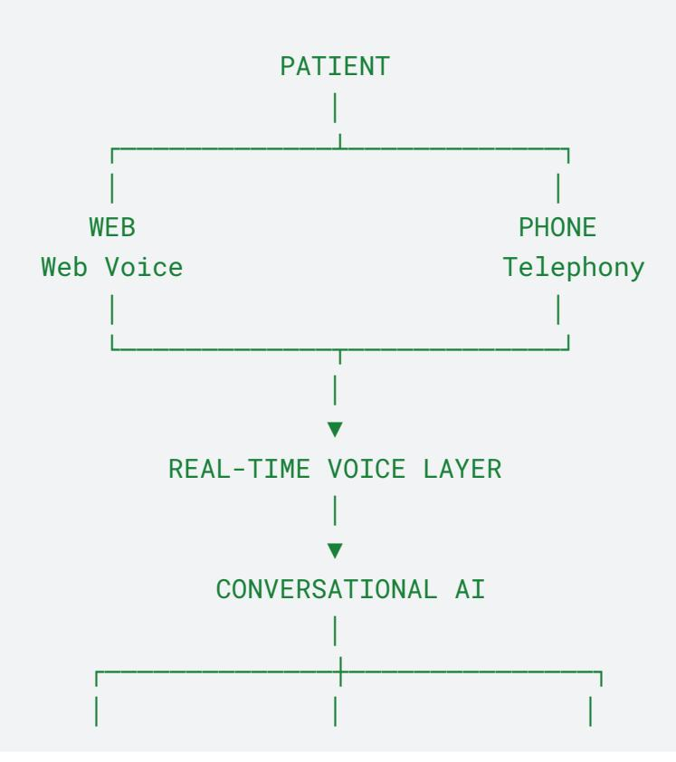
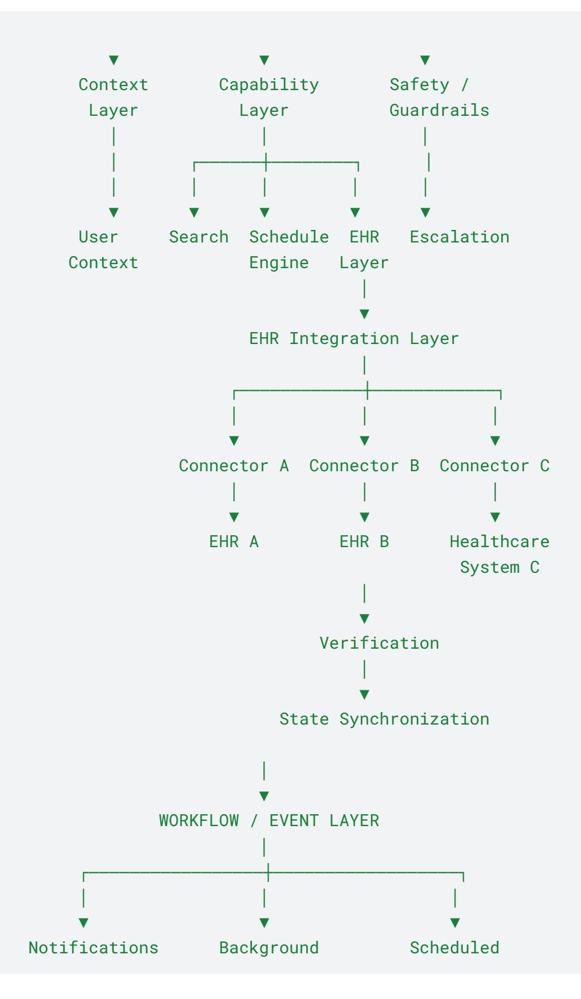
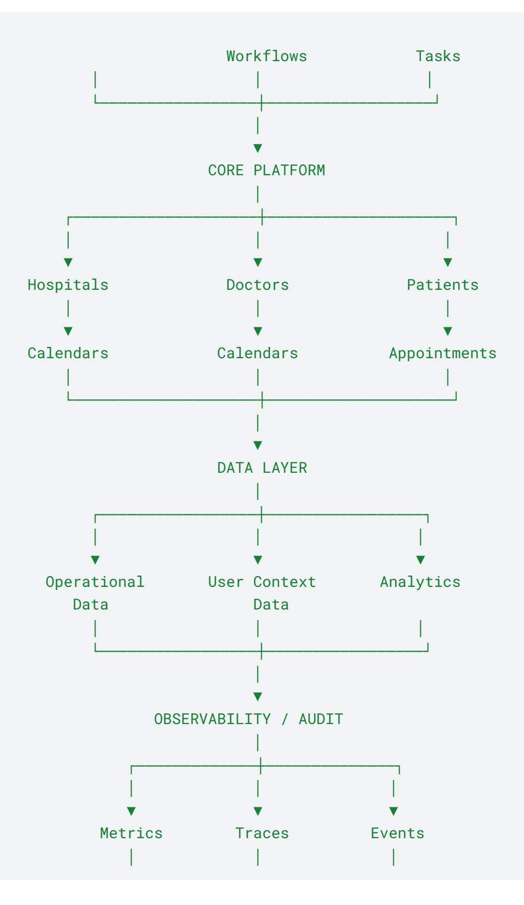
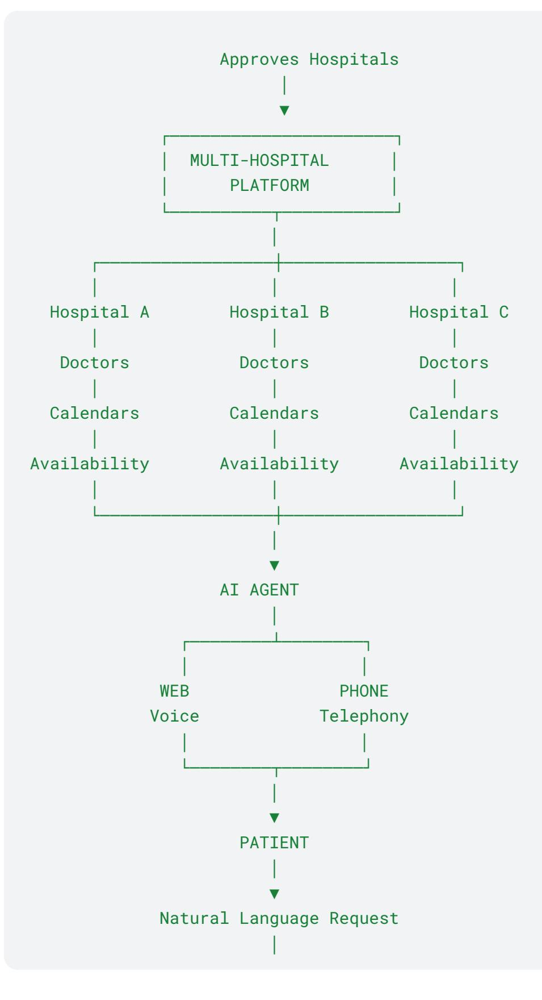
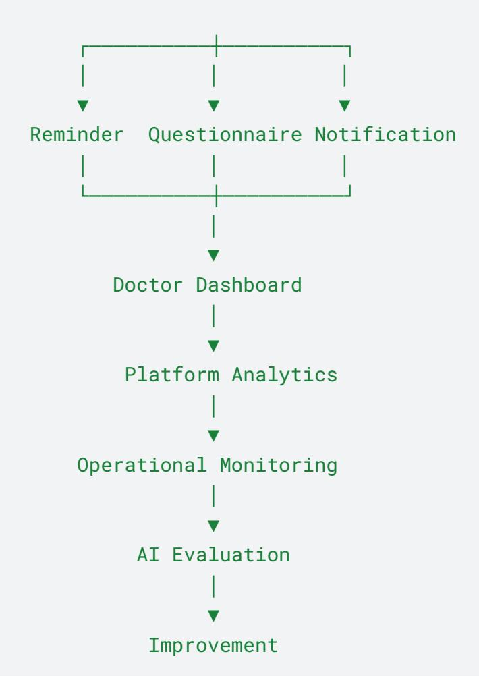

# **Product Requirements Document**

# **Autonomous Multi-Hospital Patient Intake, Scheduling & Pre-Visit Voice Agent**

**Multi-Tenant Healthcare Discovery, Scheduling, Patient Intake & AI Operations Platform**

**Product Owner:** AI.Prof

**Version:** 2.0

**Status:** Product & Technical Blueprint

**Target:** 3–4 Day Prototype

**Revision:** AI-Native, Workflow-Driven, Observable Multi-Hospital Platform with EHR / Healthcare-System Integration

# **1. Platform Overview**

This platform is a multi-tenant healthcare operations and patient-access platform connecting:

- Hospitals
- Hospital administrators
- Doctors
- Patients
- AI conversational interfaces
- Scheduling systems
- EHRs and healthcare information systems
- External healthcare systems
- Operational workflows

through one unified platform.

Hospitals register on the platform and submit their organizational information for verification.

A platform administrator reviews and approves each hospital before it becomes active.

Once approved, each hospital receives an isolated administration environment where authorized users can configure:

- Hospital information
- Departments
- Specialties
- Doctors
- Consultation types
- Working hours
- Appointment durations
- Calendars
- Availability rules
- Blocked periods
- Doctor instructions
- Pre-visit questionnaires
- Communication preferences
- Operational workflows
- External healthcare-system configuration
- EHR integration settings

Doctors can manage their own calendars and availability.

Patients can register and interact with the platform through conversational interfaces such as:

- Web-based real-time voice
- Telephone
- Future conversational channels

The AI acts as an intelligent healthcare access layer.

A patient should be able to naturally say:

"I've been having back pain for the last two weeks and I want to see a doctor."

The platform should understand the request, determine the appropriate appointment intent, identify relevant healthcare services, search hospitals and doctors, check actual availability, clarify missing information, present suitable options, and complete the booking through authorized platform capabilities.

Where a hospital has an integrated EHR or healthcare information system, the appointment operation should be synchronized with that external system through a controlled integration layer.

The platform must verify the external operation before communicating successful completion to the patient.

After booking, the platform may initiate an approved pre-visit information collection workflow.

The system should remember relevant context across the interaction so that patients do not have to repeatedly provide the same information unnecessarily.

The platform should also support background operational workflows such as:

- Appointment reminders
- Questionnaire reminders
- Follow-up notifications
- Booking failure handling
- EHR integration recovery
- External-system synchronization
- Reconciliation
- Escalation workflows
- Status synchronization
- Scheduled operational tasks
- Analytics processing
- System health checks

The platform must provide complete visibility into important AI and system operations.

### This includes:

- AI interactions
- Tool executions
- EHR integration operations
- External-system operations
- Workflow executions
- Scheduling operations
- Integration verification
- Synchronization
- Reconciliation
- Failures
- Retries

None Platform │ ├── Hospital A │ ├── Doctors │ ├── Calendars │ ├── Appointments │ └── EHR / Healthcare System │ ├── Hospital B │ ├── Doctors │ ├── Calendars │ ├── Appointments │ └── EHR / Healthcare System

- Escalations
- Performance
- Costs
- Evaluation results
- Audit events

The platform therefore combines:

**Multi-Hospital Management + Doctor Scheduling + Patient Registration + Conversational AI + Real-Time Voice + Tool-Based AI Actions + EHR / Healthcare-System Integration + Persistent Context + Patient Intake + Workflow Automation + Analytics + Evaluation + Observability + Auditability**

# **1.1 How This Is Different From a Traditional Hospital Booking System**

## **Multi-hospital rather than single-hospital**

The platform creates a healthcare network:

│ └── Hospital C ├── Doctors ├── Calendars ├── Appointments └── EHR / Healthcare System

The AI can search across participating hospitals.

## **AI-first patient access**

Patients should not need to understand the internal structure of a healthcare organization.

They can say:

"I need a dermatologist."

or:

"I've been having skin irritation for the last week. Can you find me a doctor?"

The AI converts natural conversation into structured actions.

## **Hospital-controlled operations**

Each hospital maintains control over:

- Doctors
- Calendars
- Working hours
- Appointment duration
- Blocked slots
- Leave
- Availability
- Doctor instructions

- Approved questionnaires
- Operational preferences
- EHR / healthcare-system configuration

The AI must not override hospital configuration.

## **Doctor-controlled calendars**

Doctors control:

- Working hours
- Breaks
- Leave
- Blocked slots
- Available slots
- Appointment types
- Consultation duration

The AI must respect these constraints.

## **AI as an interface, not a medical decision-maker**

The AI assists with healthcare access and administrative workflows.

It must not:

- Diagnose disease
- Prescribe medication
- Change medication
- Make independent clinical decisions
- Generate unsupported clinical assessments

The platform must distinguish:

### **Patient-reported information**

from:

### **Clinical diagnosis**

and:

### **Clinician-approved information collection**

# **1.2 Persistent Patient Context**

The platform should maintain relevant user context so the conversational experience becomes progressively more useful.

The system may retain appropriate information such as:

- Previously selected hospitals
- Previously selected doctors
- Preferred appointment windows
- Communication preferences
- Previously provided non-sensitive profile information
- Active appointment context
- Current conversation state
- Previously completed workflow steps
- Relevant interaction preferences

The purpose is not to store everything.

The system should retain only useful context that improves future interactions.

Example:

### **Patient:**

"Book me an appointment with Dr. Sharma."

### **AI:**

"Would you prefer the afternoon again?"

The patient should not necessarily need to repeat preferences already known by the system.

The platform must provide clear boundaries between:

- Current conversation state
- Short-term interaction context
- Longer-term user preferences
- Appointment-specific information
- Sensitive healthcare information
- System-generated operational data

Sensitive information must be handled according to the platform's security and privacy requirements.

# **1.3 Context-Aware Conversations**

The AI should understand references such as:

"Book that one."

"Actually, make it Friday."

"Same doctor as last time."

"Cancel my upcoming appointment."

"Reschedule that appointment to Monday."

The system should resolve these statements against the active context before performing an action.

When context is ambiguous, the AI should ask for clarification instead of guessing.

# **1.4 Action-Oriented AI**

The AI should not merely generate conversational responses.

It should be capable of performing authorized actions through explicit capabilities.

- Search hospitals
- Search doctors
- Check availability
- Retrieve appointment information
- Create appointment
- Reschedule appointment
- Cancel appointment
- Retrieve questionnaire
- Submit questionnaire response
- Send notification
- Initiate approved workflow
- Escalate to human support
- Interact with configured EHR / healthcare systems
- Verify external appointment status
- Synchronize appointment state

Every action should have:

- A defined input schema
- A defined output schema
- Authorization rules
- Validation
- Failure handling
- Audit information
- Idempotency behavior where required
- Verification behavior where required

# **1.5 EHR / Healthcare-System Connectivity**

The platform should be designed so healthcare organizations can connect existing operational and clinical information systems without tightly coupling the AI agent to individual implementations.

The integration architecture should support configured healthcare systems such as:

- EHR systems
- Hospital information systems
- Scheduling systems

None AI Agent ↓ Capability Layer ↓ Appointment / Scheduling Service ↓ EHR Integration Layer ↓ EHR Connector / Integration Adapter ↓ Configured Healthcare System ↓ Verification ↓ Platform State Synchronization

- Patient management systems
- Communication systems
- Calendar systems
- Notification systems
- Other approved healthcare operational systems

The AI should not directly communicate with individual EHR implementations.

Instead:

The integration layer should abstract vendor-specific implementation details.

Where supported, integrations may use standard healthcare interoperability interfaces and APIs.

The platform should maintain mappings for:

- Patient identity
- Provider identity
- Facility identity
- Department
- Appointment type
- Calendar

None Appointment Confirmed ↓ Create Reminder Workflow ↓ Wait Until Reminder Window ↓ Send Reminder ↓ Record Delivery

- Slot
- Appointment status
- External appointment identifier

The platform must not claim an appointment has been successfully booked until the external system confirms the operation or the platform has otherwise verified the authoritative state.

# **1.6 Workflow-Driven Operations**

Not every action should happen directly inside the conversational request.

The platform should support workflows that can execute:

- Immediately
- Asynchronously
- At a scheduled time
- After an event
- After a successful booking
- After a failed operation
- After a defined period
- After a user action
- After EHR synchronization
- After integration failure
- After reconciliation

None EHR Integration Failed ↓ Classify Failure ↓ Retry if Safe ↓ Verify External State ↓ Reconcile if Required ↓ Escalate if Unresolved

↓ Update Appointment Activity

Another example:

Workflow execution should be observable and traceable.

# **1.7 Operational Intelligence**

The platform should provide visibility not only into business activity but also into how the AI and healthcare-system integration layers are functioning.

Administrators and developers should be able to understand:

- What the AI attempted
- Which capabilities it invoked
- Which EHR / external healthcare system was contacted
- Which integration connector was used
- How long operations took
- Where failures occurred
- Whether retries were triggered
- Whether verification succeeded

- Whether reconciliation was required
- Whether recovery succeeded
- Whether a human escalation occurred
- Which model/AI configuration was used where appropriate
- Approximate AI usage
- Approximate cost
- Overall workflow health

# **2. Horizontal Flow Diagram — Complete Platform**

The platform operates as a continuous ecosystem rather than a single booking transaction.

| → Admin        |                |                    |               |
|----------------|----------------|--------------------|---------------|
|                | → Hospital     |                    |               |
|                |                | → Doctor &         |               |
|                |                |                    | → Availabilit |
| → Conversation |                |                    |               |
| al Agent       |                |                    |               |
|                | → Understand   |                    |               |
|                |                | → Find Hospitals & |               |
|                |                |                    | → Check       |
| → Appointment  |                |                    |               |
|                | → Scheduling   |                    |               |
|                |                | → EHR / External   |               |
|                |                |                    | → External    |
| → Pre-Visit    |                |                    |               |
|                | → Patient      |                    |               |
|                |                | → Doctor Review    | → Analytics & |
| → Background   |                |                    |               |
|                | → Notification | → Status           |               |
|                |                |                    | → Continuous  |

# **3. Product Vision & Executive Summary**

## **3.1 Executive Summary**

The platform provides a unified healthcare access and operations layer connecting multiple hospitals, doctors, and patients through intelligent conversational and workflow-driven experiences.

Hospitals configure their operational environment.

Doctors configure their schedules.

Patients describe their requirements naturally.

The AI understands the request and coordinates the appropriate workflow.

Scheduling systems verify availability.

EHR / healthcare-system integrations execute authorized external operations.

The platform verifies external outcomes before confirming them.

Background workflows handle operational follow-up.

The platform records important system events.

Administrators monitor the entire ecosystem.

The AI does not replace clinicians.

Its purpose is to:

- Reduce healthcare access friction
- Automate repetitive administrative operations
- Improve appointment discovery
- Provide conversational patient access
- Maintain useful interaction context
- Collect structured pre-visit information
- Reduce administrative workload
- Improve doctor preparation
- Automate operational follow-up
- Provide system-wide visibility
- Improve reliability
- Maintain traceability
- Enable measurable AI quality improvement

# **3.2 Product Vision**

Traditional healthcare appointment systems require patients to understand:

- Which specialty they need
- Which doctor to choose
- Which hospital to use
- Which calendar is available
- Which healthcare system is involved
- Which information needs to be provided

This platform moves that complexity behind a conversational interface.

The patient should simply describe what they need.

The system then coordinates:

- 1. Understanding
- 2. Context resolution
- 3. Hospital discovery
- 4. Doctor discovery
- 5. Availability verification
- 6. Clarification
- 7. Appointment selection
- 8. Booking
- 9. EHR / healthcare-system integration
- 10. External verification
- 11. State synchronization
- 12. Pre-visit information collection
- 13. Notifications
- 14. Follow-up workflows
- 15. Analytics
- 16. Auditability

The product principle is:

**Hospitals configure. Doctors control availability. Patients describe their needs. The AI coordinates. Capabilities execute. Healthcare systems**

None Conversation ↓ Understanding ↓ Context ↓ Reasoning ↓ Capability Selection ↓ Action ↓ External Integration ↓ Verification ↓ Workflow ↓ State Update ↓ Analytics ↓ Next Action

**synchronize. External outcomes are verified. Workflows execute. The platform records. Humans make clinical decisions.**

# **3.3 AI-Native Product Principle**

AI should be integrated into the workflow rather than added as a simple chatbot.

The system should demonstrate:

The AI should therefore be judged by its ability to complete useful tasks reliably, not merely by conversational quality.

None Register Hospital ↓ Submit Details ↓ Admin Review ↓ Approved ↓ Configure Hospital ↓ Create Doctors ↓ Configure Calendars ↓ Define Working Hours ↓ Define Availability ↓ Create Questionnaires ↓ Configure EHR / Healthcare-System Integration ↓ Configure Operational Preferences ↓ Publish Availability ↓ Monitor Operations ↓ Review Analytics

# **4. User Journey & Platform Journey**

## **4.1 Hospital Journey**

None Doctor Created ↓ Complete Profile ↓ Configure Calendar ↓ Set Working Hours ↓ Set Availability ↓ Block Lunch / Leave / Other Periods ↓ Create Approved Questions ↓ View Appointments ↓ Review Pre-Visit Responses ↓ Review Relevant Patient Context

None Register / Login ↓ Start AI Conversation ↓ Describe Requirement ↓

# **4.2 Doctor Journey**

# **4.3 Patient Journey**

AI Understands Intent ↓ Resolve Context ↓ Search Doctors & Hospitals ↓ Check Real Availability ↓ Present Options ↓ Patient Chooses ↓ Confirm ↓ Book Appointment ↓ EHR / External System Integration ↓ Verify Booking ↓ Synchronize State ↓ Pre-Visit Workflow ↓ Patient Responds ↓ Notifications / Follow-Up ↓ Doctor Reviews ↓ Analytics Updated

# **4.4 Platform Admin Journey**

None Admin Login ↓ Review Hospital Applications ↓ Approve / Reject ↓ Monitor Platform ↓ View Appointments ↓ Monitor AI Activity ↓ Monitor EHR / Integration Activity ↓ Monitor Workflows ↓ Monitor Failures ↓ Review Audit Trail ↓ Review AI Quality ↓ Review Platform Analytics ↓ Manage Configuration

# **5. Detailed Feature Documentation**

# **5.1 Hospital Registration & Onboarding**

The platform provides self-service hospital registration.

None Draft ↓ Submitted ↓ Under Review ↓ Approved / Rejected

- Hospital name
- Organization information
- Address
- Contact information
- Email
- Phone
- Website
- Departments
- Specialties
- Operating hours
- Services
- Organization administrator
- Verification information
- Supported healthcare systems
- EHR integration configuration

Hospital states:

Only approved hospitals become active.

# **5.2 Platform Admin Approval**

Platform administrators can:

- Review hospital information
- Approve hospitals
- Reject hospitals
- Request corrections

- Suspend hospitals
- Reactivate hospitals
- View hospital activity
- Review healthcare-system integration configuration

Only approved hospitals can:

- Create active doctors
- Publish availability
- Receive bookings
- Activate supported EHR integrations

# **5.3 Hospital Administration**

Hospital administrators manage:

- Hospital profile
- Departments
- Specialties
- Doctors
- Calendars
- Availability
- Appointment settings
- Questionnaires
- Staff
- Communication preferences
- Operational workflows
- Healthcare-system integrations
- Hospital analytics

Hospital data must remain isolated.

# **5.4 Doctor Management**

- Name
- Photo
- Specialty
- Department
- Qualifications
- Experience
- Languages
- Consultation type
- Consultation duration
- Hospital association
- Professional information
- Status
- External provider identifier where required for integration

Doctor states:

- Invited
- Active
- Inactive
- Suspended

Only active doctors with valid availability can receive appointments.

# **5.5 Doctor Calendar Management**

Doctors receive calendar-based scheduling interfaces.

The calendar displays:

- Available slots
- Booked appointments
- Blocked periods
- Lunch
- Working hours
- Leave
- Other unavailable periods

Doctors may configure multiple calendars where required.

None Slot ↓ Doctor Active? ↓ Calendar Active? ↓ Within Working Hours? ↓ Not Blocked? ↓ Not Leave? ↓ Not Lunch? ↓ Not Already Booked? ↓ Appointment Type Compatible? ↓ EHR / External Calendar Compatible? ↓ BOOKABLE

Possible examples:

- Hospital consultation
- Online consultation
- Follow-up consultation
- Specialty-specific consultation

# **5.6 Availability & Slot Engine**

The platform contains a centralized availability engine.

A slot is bookable only when all applicable conditions are satisfied.

The AI must never invent availability.

It must query actual scheduling information before presenting slots.

# **5.7 Appointment Management**

The platform supports:

- New booking
- Rescheduling
- Cancellation
- Confirmation
- Appointment history
- Appointment reminders
- Status tracking
- Follow-up workflows
- External appointment synchronization

Appointment states may include:

- Requested
- Pending
- Confirmed
- Rescheduled
- Cancelled
- Completed
- No-show
- Failed
- Synchronization Pending
- Reconciliation Required

Every appointment should maintain a history of changes.

Where an external healthcare system is connected, the appointment should maintain both:

- Internal appointment state
- External appointment reference/state

# **5.8 Patient Registration & Profile**

Patient profiles may contain:

- Name
- Contact information
- Date of birth
- Preferred communication channel
- Appointment history
- Saved preferences
- Required non-clinical information
- External patient identifier where supported

The platform should follow data minimization.

Patients can:

- View appointments
- Cancel appointments
- Request rescheduling
- Complete questionnaires
- Manage profile information
- Manage communication preferences

# **5.9 AI Patient Access Agent**

The AI agent is the primary conversational interface.

It should support:

- Natural language understanding
- Context resolution
- Intent detection
- Clarification
- Tool/capability selection
- Structured actions
- Persistent interaction context
- Workflow initiation

None Patient ↓ Audio Stream ↓ Real-Time Communication Layer ↓ Streaming Speech Recognition ↓ AI Agent ↓ Capability / Workflow Layer ↓ Scheduling / Integration Layer ↓ Streaming Speech Generation ↓ Audio Stream ↓ Patient

- Error handling
- EHR integration orchestration
- Verification
- Human escalation

The same underlying capabilities should be reusable across web voice, telephone, and future channels.

# **5.10 Real-Time Voice Pipeline**

The voice experience should use a streaming architecture rather than a simple sequential request-response model.

Conceptually:

None AI Agent ↓ Escalation Required ↓

The system should support:

- Streaming audio
- Natural turn-taking
- Barge-in
- Interruption handling
- Silence handling
- Low-latency responses
- Graceful handling of long-running operations

Target:

**Sub-2-second perceived response latency for normal conversational turns**, subject to model, provider, and network conditions.

# **5.11 Telephony Integration**

The platform should support inbound telephone interactions.

The system should support:

- Inbound call handling
- Call identification
- Patient lookup
- Appointment booking
- Rescheduling
- Cancellation
- Call termination
- Human escalation
- Call failure handling

If the agent fails:

Human Support

# **5.12 Patient Intent & Requirement Understanding**

Patients may not explicitly name a specialty.

Example:

"I've been having shoulder pain for the last few weeks."

The system may infer that an orthopedic appointment could be relevant for scheduling purposes.

However, it must distinguish:

### **Patient-reported symptom**

from:

### **Medical diagnosis**

The system must use cautious language.

If information is insufficient, it should ask a clarification question.

# **5.13 Hospital & Doctor Discovery**

The agent can search using:

- Specialty
- Department
- Hospital
- Location

None Understand Request ↓ Identify Appointment Category ↓ Find Relevant Doctors ↓ Search Participating Hospitals ↓ Check Availability ↓ Apply Scheduling Rules ↓ Return Actual Slots

None search\_hospitals()

- Doctor
- Appointment type
- Date
- Time preference
- Availability
- User preferences

Example:

"Find me a dermatologist this Friday afternoon."

The system:

# **5.14 Capability / Tool Layer**

The AI must interact with the platform through explicit capabilities.

Example capabilities:

search\_specialties() search\_doctors() check\_availability() get\_doctor\_calendar() lookup\_patient() create\_appointment() reschedule\_appointment() cancel\_appointment() get\_appointment() get\_questionnaire() submit\_questionnaire\_response() send\_notification() start\_workflow() get\_user\_context() update\_user\_preferences() verify\_external\_appointment() synchronize\_appointment\_state() transfer\_to\_human()

Each capability should have:

- Structured schema
- Validation
- Authorization
- Clear success response
- Clear failure response
- Logging
- Retry behavior where appropriate
- Idempotency behavior where required
- Verification behavior where required

The AI must not directly manipulate underlying data in uncontrolled ways.

None AI Agent ↓ Capability Registry ↓ Available Actions ↓ Authorized Capability ↓ Execution ↓ Verification ↓ Result

# **5.15 Capability Discovery & External Actions**

The platform should provide a standardized way for the AI to discover and invoke available capabilities.

Capabilities may originate from:

- Internal application services
- Scheduling services
- Communication services
- EHR connectors
- Healthcare-system integration adapters
- Approved external healthcare systems
- Workflow services
- Notification services

The AI should not need to know the implementation details of each capability.

Conceptually:

The capability interface should be designed to support future expansion without redesigning the core agent.

None intent = BOOK\_APPOINTMENT specialty = Cardiology date = Friday time\_preference = Afternoon selected\_doctor = null selected\_hospital = null selected\_slot = null appointment\_status = pending

# **5.16 Conversation State & Context**

The agent must maintain an active conversation state.

Example:

The state persists until the workflow is:

- Completed
- Cancelled
- Abandoned
- Expired

# **5.17 Persistent User Context**

None Current Conversation State ↓ Short-Term Context ↓ Longer-Term User Preferences ↓ Appointment-Specific Information

Potential context:

- Preferred hospitals
- Preferred doctors
- Appointment timing preferences
- Communication preferences
- Previous appointment patterns
- Saved non-sensitive preferences
- Relevant workflow history
- Previous conversation summaries where appropriate

The system should distinguish between:

Context should be retrieved only when relevant.

The AI should not expose internal context storage mechanisms to users.

# **5.18 Context Resolution**

The system should resolve conversational references.

Examples:

"Book that doctor."

"Actually Friday."

"Same hospital as last time."

"Cancel my upcoming appointment."

The system should identify the relevant entity from the active context.

If multiple interpretations are possible:

"I have two upcoming appointments. Which one would you like to cancel?"

The AI must ask rather than guess.

# **5.19 Ambiguity Handling**

The AI must ask for missing information.

Examples:

"I need an appointment next Thursday."

If the exact date interpretation is ambiguous, the system should clarify.

If two doctors match:

"I found two cardiologists available. Would you prefer Dr. Sharma or Dr. Rao?"

If no suitable slot exists:

"Dr. Sharma doesn't have any afternoon appointments available on Thursday. Would you like me to check Friday?"

# **5.20 EHR / Healthcare System Integration**

The EHR / Healthcare System Integration Layer is responsible for communicating with configured external healthcare systems.

The AI agent must not directly manipulate an EHR.

The intended architecture is:

None AI Agent ↓ Appointment Capability ↓ Scheduling Service ↓ EHR Integration Layer ↓ Integration Adapter / Connector ↓ Configured EHR / Healthcare System ↓ External Operation ↓ Verification ↓ Platform State Synchronization

None

The integration layer should support controlled operations such as:

- Patient lookup
- Patient identity resolution
- Provider lookup
- Facility lookup
- Calendar lookup
- Availability retrieval where supported
- Appointment creation
- Appointment update
- Appointment rescheduling
- Appointment cancellation
- Appointment retrieval
- Appointment status verification

### **Core integration sequence**

Validate Patient

None Internal Patient ID ↕ External Patient ID Internal Doctor ID ↕

↓ Resolve External Patient ↓ Validate Provider ↓ Resolve External Provider ↓ Resolve Facility / Department ↓ Resolve Calendar ↓ Map Appointment Type ↓ Validate Slot ↓ Create / Update Appointment ↓ Receive External Identifier ↓ Verify External Record ↓ Synchronize Platform State ↓ Complete

The integration layer should maintain mappings between internal and external identifiers.

None EHR Integration Layer │ ┌─────────────┼─────────────┐ │ │ │ ▼ ▼ ▼ Connector A Connector B Connector C │ │ │ ▼ ▼ ▼ EHR A EHR B Healthcare System C

External Provider ID Internal Appointment ID ↕ External Appointment ID

The platform should support different connectors without requiring changes to the conversational AI layer.

Conceptually:

For the prototype, a **Mock EHR / Mock Healthcare System** may be used to demonstrate the complete integration lifecycle.

The architecture should nevertheless be designed so that the mock connector can later be replaced by a real supported connector.

# **5.21 EHR Integration Recovery, Verification & Reconciliation**

External healthcare-system integrations must assume that failures can occur.

None EHR Operation ↓ Failure ↓ Classify Failure ↓ Retryable? ┌──┴──┐ YES NO ↓ ↓ Retry Escalate / Fail ↓ Verify External State ↓ Known State? ┌─┴─────┐ YES NO

- API timeout
- Authentication failure
- Authorization failure
- Expired token
- Rate limiting
- Network failure
- Temporary EHR unavailability
- Validation error
- Schema mismatch
- Mapping failure
- Provider not found
- Patient not found
- Slot no longer available
- Appointment already exists
- Duplicate request
- Inconsistent external state
- Partial success
- Unknown external outcome

The recovery flow should be:

None Unknown Outcome ↓ Query External System ↓ Find Matching Record? ┌──┴──┐ YES NO ↓ ↓ Sync Retry Safely State ↓

↓ ↓ Sync Reconcile ↓ ↓ Complete Escalate

### **Verification**

The platform must never assume that a request succeeded simply because the external API returned a transport-level success.

Where appropriate, the system should verify:

- External appointment identifier
- Patient
- Provider
- Facility
- Date
- Time
- Appointment status

### **Reconciliation**

If the platform cannot determine whether an operation succeeded, it should not blindly repeat the operation.

Instead:

### Verify

This prevents duplicate appointments.

Every integration operation should produce operational events.

# **5.22 Appointment Confirmation**

After booking, the system should return:

- Appointment ID
- External appointment ID where applicable
- Hospital
- Doctor
- Specialty
- Date
- Time
- Appointment type
- Status

The AI must only confirm the appointment after actual verification.

Example:

"Your appointment with Dr. Rao at City Hospital is confirmed for Thursday at 4:30 PM."

If external synchronization is still pending, the system should not incorrectly communicate confirmed completion.

# **5.23 Doctor-Configured Pre-Visit Questionnaire**

Doctors can configure approved questions.

Example:

### **Dr. Rao — Cardiology**

- Have you experienced chest discomfort recently?
- When did it begin?
- Does it occur during physical activity?
- Are you currently taking any prescribed medication?

The AI asks the questions conversationally.

# **5.24 Specialty / Condition-Specific Questionnaires**

Questionnaires may be associated with:

- Specialty
- Appointment type
- Condition category
- Doctor configuration

The platform should use approved question sets rather than allowing the AI to independently invent clinical questions.

# **5.25 Questionnaire Engine**

Questionnaires are structured entities.

None Questionnaire │ ├── Title ├── Specialty ├── Version ├── Status ├── Questions └── Applicability Rules

Response types may include:

- Yes/No
- Multiple choice
- Single choice
- Numeric
- Date
- Short text
- Long text
- Structured response

The AI converts conversational responses into the required structured format.

# **5.26 Questionnaire Conversation**

The patient should not feel like they are completing a rigid form.

Example:

**AI:** Before we finish, Dr. Rao has asked a few questions to help prepare for your visit. Is that okay?

**Patient:** Yes.

**AI:** Have you experienced chest discomfort recently?

**Patient:** Yes, a few times.

None Appointment Confirmed ↓ Schedule Reminder ↓ Reminder Window Reached ↓

**AI:** When did you first notice it?

**Patient:** About two weeks ago.

The platform stores structured responses.

# **5.27 Questionnaire Safety Principle**

The platform is not a diagnostic engine.

The AI must not:

- Diagnose
- Prescribe
- Change medication
- Provide unsupported medical advice
- Generate arbitrary medical assessments

If potentially urgent information is reported, the system follows a predefined escalation policy.

# **5.28 Background Workflow Engine**

The platform should support asynchronous and scheduled workflows.

Examples:

### **Appointment reminder**

None Questionnaire Pending ↓ Wait ↓ Reminder ↓ Patient Completes ↓ Stop Reminder Workflow

None Booking Failed ↓ Integration Recovery Policy ↓ Retry ↓ Verify External State ↓ Success → Complete ↓ Failure → Reconcile / Escalate

None Appointment Created

Send Notification ↓ Record Result

### **Questionnaire reminder**

### **Failed booking**

### **Post-booking workflow**

↓ Update Patient ↓ Synchronize EHR ↓ Notify Doctor ↓ Create Questionnaire Task ↓ Schedule Reminder ↓ Update Analytics

The workflow system should support:

- Trigger-based execution
- Scheduled execution
- Delayed execution
- Conditional branching
- Retries
- Failure handling
- Idempotency
- External-system verification
- Reconciliation
- Execution history
- Status tracking

# **5.29 Event-Driven Platform Behavior**

Important system events should be represented as structured events.

None

HOSPITAL\_APPROVED

DOCTOR\_CREATED

APPOINTMENT\_REQUESTED

APPOINTMENT\_BOOKED

APPOINTMENT\_CANCELLED

APPOINTMENT\_RESCHEDULED

QUESTIONNAIRE\_ASSIGNED

QUESTIONNAIRE\_COMPLETED

AI\_CONVERSATION\_STARTED

AI\_TOOL\_EXECUTED

EHR\_INTEGRATION\_STARTED

EHR\_INTEGRATION\_COMPLETED

EHR\_INTEGRATION\_FAILED

EHR\_SYNC\_VERIFIED

EHR\_RECONCILIATION\_REQUIRED

WORKFLOW\_STARTED

WORKFLOW\_COMPLETED

WORKFLOW\_FAILED

### HUMAN\_ESCALATION\_TRIGGERED

Events may be consumed by:

- Analytics
- Notifications
- Workflows
- Audit systems
- Monitoring
- Evaluation systems
- Reconciliation processes

This prevents every feature from becoming tightly coupled to every other feature.

# **5.30 Notification System**

The platform should support configurable notifications.

### **Patient**

- Appointment confirmation
- Appointment reminder
- Rescheduling confirmation
- Cancellation confirmation
- Questionnaire reminder
- Questionnaire completion
- Workflow updates
- Integration-related updates where appropriate

### **Doctor**

- New appointment
- Appointment cancellation
- Appointment rescheduled
- Questionnaire completed
- Upcoming appointment

- Important operational notifications

### **Hospital**

- Hospital approval
- Hospital rejection
- New appointment
- Cancellation
- Rescheduling
- Doctor status changes
- Operational alerts
- Integration failures

# **5.31 Doctor Dashboard**

The doctor dashboard provides:

### **Home**

- Today's appointments
- Upcoming appointments
- Pending questionnaires
- Recently completed questionnaires

### **Calendar**

- Day
- Week
- Month
- Multiple calendars
- Booked slots
- Available slots
- Blocked slots
- Leave

### **Appointment Details**

- Patient

- Appointment
- Hospital
- Date
- Time
- Appointment type
- Status
- Pre-visit questionnaire
- Relevant authorized context
- External appointment reference where applicable

# **5.32 Hospital Dashboard**

Hospital administrators receive an organization-specific dashboard.

### **KPIs**

- Appointments today
- Upcoming appointments
- Active doctors
- Available slots
- Cancelled appointments
- Rescheduled appointments
- AI bookings
- Human escalations
- Questionnaire completion
- Workflow failures
- EHR integration success
- EHR integration failures
- Reconciliation items

### **Management**

- Departments
- Specialties
- Doctors
- Calendars
- Availability
- Questionnaires

None HOSPITALS 42 DOCTORS 864 PATIENTS 18,420 APPOINTMENTS TODAY 1,243 AI CALLS TODAY 1,817 BOOKING SUCCESS 94.2% QUESTIONNAIRE COMPLETE 88.7% HUMAN ESCALATION 4.1% AVG AI LATENCY 1.4s EHR INTEGRATION SUCCESS 97.8%

- Staff
- Workflows
- Communication settings
- Healthcare-system integrations

# **5.33 Platform Admin Dashboard**

The global operational dashboard should show:

Admin can view authorized:

- Hospitals
- Doctors
- Patients
- Appointments
- AI interactions
- Workflows
- System failures
- EHR integration operations
- External-system events
- Audit events
- Platform analytics
- AI evaluation results

None CALL\_STARTED ↓ PATIENT\_IDENTIFIED ↓ INTENT\_DETECTED ↓ CONTEXT\_RETRIEVED ↓ SEARCH\_DOCTORS ↓ CHECK\_AVAILABILITY ↓ PATIENT\_SELECTED\_SLOT ↓ BOOKING\_STARTED ↓ EHR\_INTEGRATION\_STARTED ↓ EXTERNAL\_RECORD\_CREATED ↓ EHR\_SYNC\_VERIFIED ↓ BOOKING\_VERIFIED ↓ QUESTIONNAIRE\_STARTED

# **5.34 Operational Observability**

The platform should provide a dedicated operational visibility layer.

It should allow administrators/developers to understand a complete operation from beginning to end.

None Conversation │ ├── AI Decision │ ├── Capability Call │ ├── Scheduling Operation │ ├── EHR Integration Operation

↓ QUESTIONNAIRE\_COMPLETED ↓ NOTIFICATION\_SENT ↓ CALL\_COMPLETED

The platform should make it possible to identify:

- Where latency occurred
- Where failures occurred
- Which action failed
- Which external system failed
- How many retries occurred
- Whether recovery succeeded
- Whether reconciliation occurred
- Whether an escalation happened

# **5.35 Correlation & Traceability**

A single user operation should be traceable across multiple system components.

For example:

│ ├── Verification │ ├── Synchronization │ ├── Workflow │ ├── Notification │ └── Audit Event

These related events should be connected through a common operation or correlation identifier.

This makes debugging and operational investigation significantly easier.

# **5.36 AI Usage & Cost Tracking**

The platform should track AI usage where technically available.

Possible metrics:

- Number of AI requests
- Input usage
- Output usage
- Voice duration
- AI processing duration
- Estimated AI cost
- Cost by hospital
- Cost by feature
- Cost by conversation
- Cost by workflow

The purpose is to demonstrate that the system can monitor AI economics rather than treating model usage as invisible infrastructure.

# **5.37 AI Evaluation**

The platform should provide internal evaluation capabilities.

### **Conversational AI**

Evaluate:

- Intent accuracy
- Context resolution
- Response correctness
- Appropriate clarification
- Unsupported request handling
- Tool selection
- Tool argument correctness

### **Scheduling**

Evaluate:

- Correct availability
- Booking correctness
- Double-booking prevention
- Verification success

### **EHR / External Integration**

Evaluate:

- Integration action completion
- Request correctness
- Patient mapping correctness
- Provider mapping correctness
- Appointment mapping correctness
- External record creation
- Verification success
- Synchronization correctness
- Recovery behavior

None AI Interaction ↓ Outcome ↓ Evaluation ↓ Failure / Success Classification ↓ Review ↓ Prompt / Workflow / Capability / Integration Improvement ↓ New Evaluation

- Reconciliation behavior
- Duplicate prevention

### **Questionnaire**

Evaluate:

- Question ordering
- Structured extraction
- Response accuracy
- Completion reliability

Evaluation results should be measurable and reviewable.

# **5.38 AI Quality Feedback Loop**

The platform should support continuous improvement.

Conceptually:

This demonstrates that AI development is treated as an engineering lifecycle rather than a one-time prompt implementation.

None AI Agent ↓ Escalation Required ↓ Human Support

# **5.39 Human Escalation**

The AI should recognize when it should stop autonomous processing.

Examples:

- Patient explicitly requests a human
- Booking system repeatedly fails
- EHR integration repeatedly fails
- External state cannot be verified
- Identity cannot be established
- Required information cannot be resolved
- Complex unsupported request
- Safety policy requires escalation

Flow:

The escalation should be recorded.

The system should provide the human operator with relevant authorized context so the patient does not have to repeat the entire interaction unnecessarily.

# **5.40 Audit Trail**

Every important system operation should produce an auditable event.

None 15:42:01 CALL\_STARTED 15:42:05 PATIENT\_IDENTIFIED 15:42:09 AI\_CONTEXT\_RETRIEVED 15:42:11 TOOL\_CALL: lookup\_patient 15:42:12 TOOL\_CALL: search\_doctors 15:42:14 TOOL\_CALL: check\_availability 15:42:18 PATIENT\_SELECTED\_SLOT 15:42:20 BOOKING\_STARTED 15:42:22 EHR\_INTEGRATION\_STARTED 15:42:27 EXTERNAL\_APPOINTMENT\_CREATED 15:42:30 EHR\_SYNC\_VERIFIED 15:42:32 BOOKING\_VERIFIED 15:42:35 QUESTIONNAIRE\_STARTED 15:44:01 QUESTIONNAIRE\_COMPLETED 15:44:05 WORKFLOW\_STARTED 15:44:05 CALL\_COMPLETED

Audit events should support:

- Debugging
- Reliability
- Operational monitoring
- Dispute investigation
- Agent evaluation
- Security review
- Integration troubleshooting

# **5.41 Privacy-Aware Logging**

Healthcare-related conversations may contain sensitive information.

The platform should avoid unnecessary storage of raw sensitive content.

Operational logging should prefer structured events such as:

None PATIENT\_IDENTIFIED APPOINTMENT\_SEARCHED APPOINTMENT\_BOOKED EHR\_SYNC\_VERIFIED QUESTIONNAIRE\_COMPLETED

rather than unnecessarily storing raw conversational content.

Access to:

- Patient information
- Transcripts
- Questionnaire responses
- Recordings
- Operational details
- Integration details

must be permission-controlled.

The system should be designed with applicable healthcare privacy and security requirements in mind.

# **6. Role-Based Access Control**

The platform should enforce clear role boundaries.

## **Platform Admin**

Can:

- Approve hospitals
- Suspend hospitals
- View global analytics
- Manage platform configuration
- Review audit events
- Review operational health

- Review AI evaluations
- Review EHR integration health

## **Hospital Admin**

Can:

- Manage hospital profile
- Create doctors
- Manage calendars
- Configure availability
- Manage questionnaires
- View appointments
- View hospital analytics
- Configure approved workflows
- Manage staff
- Configure supported healthcare-system integrations

Cannot access another hospital's private data.

## **Doctor**

Can:

- Manage own calendar
- Block slots
- Configure approved questionnaires
- View own appointments
- View authorized patient responses

## **Patient**

Can:

- Manage own profile

None Platform │ ├── Hospital │ ├── Hospital Admin │ ├── Department │ ├── Specialty │ ├── Doctor │ │ ├── Calendar │ │ ├── Availability │ │ ├── Blocked Slots │ │ └── Questionnaire │ │ │ ├── Healthcare System Connection │ │ ├── Connector │ │ ├── Configuration │ │ ├── Identifier Mappings │ │ └── Integration Status │ │ │ └── Appointments │ ├── Patient │ └── External Patient Mapping │

- Book appointments
- Reschedule
- Cancel
- Complete questionnaires
- View own appointments
- Manage appropriate preferences

# **7. Core Data Model**

The core platform entities are expected to include:

├── User Context │ ├── Preferences │ ├── Conversation Summaries │ └── Relevant Interaction Context │ ├── Appointment │ ├── Doctor │ ├── Hospital │ ├── Calendar │ ├── Slot │ ├── External Appointment ID │ └── Questionnaire Responses │ ├── Questionnaire │ ├── Questionnaire Response │ ├── AI Conversation │ ├── AI Context │ ├── Capability │ ├── Capability Execution │ ├── EHR Integration Operation │ ├── Integration Verification │ ├── Reconciliation Record │ ├── Workflow │ ├── Workflow Execution │ ├── Notification

None Register ↓ Verify ↓ Create Profile ↓ Platform Access

│ ├── AI Evaluation │ ├── Audit Event │ └── Operational Event

# **8. Complete End-to-End Patient Workflow**

## **Step 1 — Patient Registration**

## **Step 2 — Start Conversation**

Patient uses:

- Web voice
- Telephone

## **Step 3 — Describe Requirement**

None Intent = Appointment Booking Potential Specialty = Orthopedics Time Preference = This Week

"I've been having knee pain and I'd like to see a doctor this week."

## **Step 4 — Understand Intent**

The system determines:

## **Step 5 — Resolve Context**

The system retrieves relevant active context.

It may determine:

- Patient identity
- Existing appointment context
- Preferences
- Previously selected hospital
- Current conversation state

## **Step 6 — Find Doctors**

The agent searches hospitals and doctors.

## **Step 7 — Check Calendars**

None

- Working hours
- Calendar
- Existing appointments
- Blocks
- Leave
- Appointment duration
- Applicable external-system availability

## **Step 8 — Present Choices**

Example:

"I found Dr. Sharma at City Hospital on Thursday at 3 PM and Dr. Rao at Care Hospital on Friday at 11 AM."

## **Step 9 — Patient Chooses**

"I'll take Thursday at 3 PM."

## **Step 10 — Confirm**

The agent confirms the selected appointment details before executing the booking.

## **Step 11 — Book**

The scheduling capability performs the operation.

Where an external healthcare system is configured:

Scheduling Capability

None External Appointment ↓ Verify ↓ Match Patient ↓ Match Doctor ↓ Match Date ↓ Match Time ↓ Match Status

↓ EHR Integration Layer ↓ Resolve Patient ↓ Resolve Provider ↓ Resolve Calendar ↓ Map Appointment ↓ Create / Update Appointment

## **Step 12 — Verify**

The platform verifies that the appointment exists in the authoritative external system where applicable.

None External System ↓ Verified State ↓ Platform Appointment ↓ State Synchronization

None Appointment Confirmed ↓ Create Questionnaire Task ↓ Create Reminder ↓ Notify Doctor ↓ Update Analytics

## **Step 13 — Synchronize**

The platform synchronizes the external appointment state with the internal appointment record.

## **Step 14 — Confirm to Patient**

Only after successful verification:

"Your appointment is confirmed for Thursday at 3 PM."

## **Step 15 — Trigger Follow-Up Workflow**

After successful booking:

## **Step 16 — Pre-Visit Questionnaire**

If applicable:

"Dr. Sharma has a few questions that will help prepare for your appointment. Would you like to answer them now?"

## **Step 17 — Patient Responds**

The AI conversationally collects responses.

## **Step 18 — Store Responses**

Responses are attached to the appointment.

## **Step 19 — Doctor Reviews**

Doctor sees authorized responses before the appointment.

## **Step 20 — Analytics**

The complete interaction contributes to:

- Patient activity
- Hospital analytics
- AI analytics
- Workflow analytics
- EHR integration analytics
- Operational monitoring
- Audit history

None Hospital Registers ↓ Submits Details ↓ Platform Admin Reviews ↓ Hospital Approved ↓ Hospital Admin Login ↓ Configure Hospital ↓ Create Doctors ↓ Doctors Configure Calendars ↓ Configure Availability ↓ Configure Blocked Periods ↓ Create Questionnaires ↓ Configure EHR / Healthcare-System Integration ↓ Configure Workflows ↓ Publish Availability ↓ Patients Discover Hospital ↓ AI Books Appointments ↓

# **9. Complete Hospital Workflow**

None

EHR / External System Synchronization ↓ Verification ↓ Workflow Executes ↓ Notifications ↓ Doctors Receive Appointments ↓ Doctors Review Pre-Visit Information ↓ Hospital Monitors Analytics

# **10. Complete Platform Architecture**

└─────────────┼──────────────┘ │

> ▼ ADMIN / OPERATIONS DASHBOARD

# **11. Platform Dashboard — Front-End Feature Breakdown**

## **11.1 Platform Admin Dashboard**

### Pages:

- 1. Overview
- 2. Hospital Applications
- 3. Hospitals
- 4. Doctors
- 5. Patients
- 6. Appointments
- 7. AI Activity
- 8. EHR / Integration Activity
- 9. Workflows
- 10. Notifications
- 11. Analytics
- 12. AI Evaluation
- 13. Operational Health
- 14. Audit Logs
- 15. Users & Access
- 16. Settings

# **11.2 Hospital Dashboard**

### Pages:

- 1. Overview
- 2. Appointments
- 3. Doctors
- 4. Calendars
- 5. Availability
- 6. Questionnaires
- 7. Patients
- 8. AI Activity
- 9. EHR / Integration Activity
- 10. Workflows
- 11. Notifications
- 12. Analytics
- 13. Hospital Settings
- 14. Healthcare-System Integrations
- 15. Staff & Access

# **11.3 Doctor Dashboard**

### Pages:

- 1. Overview
- 2. My Calendar
- 3. Appointments
- 4. Availability
- 5. Blocked Time
- 6. Questionnaires
- 7. Patient Pre-Visit Responses
- 8. Profile
- 9. Settings

# **11.4 Patient Dashboard**

- 1. Home
- 2. AI Assistant
- 3. My Appointments
- 4. Upcoming Appointment
- 5. Questionnaire
- 6. Appointment History
- 7. Preferences
- 8. Profile
- 9. Settings

# **12. Dashboard Analytics**

## **Platform-Level Analytics**

- Total hospitals
- Active hospitals
- Pending hospitals
- Total doctors
- Total patients
- Total appointments
- Appointments by hospital
- Appointment success rate
- AI call volume
- AI booking rate
- Human escalation rate
- Questionnaire completion
- Average AI latency
- EHR integration success rate
- EHR integration failure rate
- EHR verification success
- Reconciliation rate
- Workflow success rate
- Workflow failure rate
- Notification delivery rate
- AI evaluation score

## **Hospital-Level Analytics**

- Appointments
- Doctor utilization
- Available vs booked slots
- Cancellation rate
- Rescheduling rate
- AI booking percentage
- Questionnaire completion
- Patient volume
- Workflow activity
- Notification activity
- EHR integration activity
- Integration success rate
- Integration failure rate
- Reconciliation activity

## **Doctor-Level Analytics**

- Appointments
- Available slots
- Utilization
- Cancellations
- Rescheduling
- Questionnaire completion
- Upcoming workload

# **13. Operational Monitoring Dashboard**

A dedicated operational view should show:

### **AI Health**

- Active conversations
- Average response latency

- Failed capability calls
- Escalation rate
- AI error rate
- Evaluation results

### **Workflow Health**

- Running workflows
- Completed workflows
- Failed workflows
- Retried workflows
- Average workflow duration
- Stuck executions

### **EHR / External Integration Health**

- Integration requests
- Integration operations
- Success rate
- Failure rate
- Average duration
- Verification rate
- Recovery rate
- Reconciliation count
- Unknown-outcome operations
- Connector health

### **Platform Health**

- API errors
- Background task failures
- Queue/backlog indicators
- Notification failures
- Database errors
- Service availability

# **14. Notifications**

The platform supports configurable notifications.

### **Hospital**

- Hospital approved
- Hospital rejected
- New appointment
- Cancellation
- Rescheduling
- Doctor status change
- Workflow failure
- Operational alert
- Healthcare-system integration failure

### **Doctor**

- New appointment
- Appointment cancelled
- Appointment rescheduled
- Questionnaire completed
- Upcoming appointment
- Workflow notification

### **Patient**

- Appointment confirmation
- Appointment reminder
- Rescheduling confirmation
- Cancellation confirmation
- Questionnaire reminder
- Questionnaire completion
- Important appointment updates

# **15. Reliability & Failure Handling**

The platform must explicitly handle real-world failures.

## **Voice Failures**

- Noisy audio
- Patient interruption
- Silence
- Unclear speech
- Call drop

## **Agent Failures**

- Capability failure
- Missing information
- Ambiguous request
- Unsupported request
- Long-running operation
- Context resolution failure

## **Scheduling Failures**

- Slot becomes unavailable
- Double-booking attempt
- Calendar conflict
- Doctor becomes unavailable

## **EHR / External Integration Failures**

- API timeout
- Authentication failure
- Authorization failure
- Expired credentials
- Rate limit
- Network error
- EHR unavailable
- Schema mismatch
- Mapping failure
- Patient not found
- Provider not found
- Appointment conflict
- Duplicate request

None Operation ↓ Failure ↓ Determine Retryable? │ ├── NO → Escalate / Fail │ └── YES ↓ Retry ↓ External State Verification ↓ Success? │ │

- Partial success
- Unknown external result
- State inconsistency

## **Workflow Failures**

- Execution timeout
- External service failure
- Notification failure
- Duplicate execution
- Dependency unavailable

# **15.1 Retry & Recovery Policies**

The system should support controlled retries.

YES NO │ ↓ │ Retry Limit │ ↓ │ Reconciliation │ ↓ │ Escalation ↓ Complete

Retries must not create:

- Duplicate bookings
- Duplicate cancellations
- Duplicate notifications
- Duplicate workflows
- Duplicate external appointments

# **15.2 Idempotency**

Critical operations should be designed so repeated requests do not accidentally produce duplicate effects.

This is particularly important for:

- Appointment creation
- Appointment cancellation
- Appointment rescheduling
- Notifications
- Workflow triggers
- EHR integration operations

External integration operations should use an appropriate idempotency key or internal correlation identifier where supported.

None Patient A → requests 3 PM Patient B → requests 3 PM

# **15.3 Booking Verification**

The system must never tell the patient:

"Your appointment is booked."

until the booking has actually been verified.

Where an EHR / external healthcare system is involved, verification should confirm the external appointment record.

# **16. Concurrency & Double-Booking Protection**

This is a critical scheduling requirement.

Example:

Only one should obtain the slot.

The scheduling layer should use appropriate:

- Locking
- Transactions
- Reservation mechanisms
- Conflict detection

The external integration layer should also verify that the slot remains available immediately before confirmation where applicable.

If another system has already claimed the slot, the platform must reconcile the conflict rather than confirming an invalid appointment.

None Hospital A ↓ Hospital A Data Hospital B ↓ Hospital B Data

# **17. Security & Data Isolation**

The platform must enforce tenant isolation.

Hospital A users must not access Hospital B's private information.

Access should be determined by:

- User role
- Hospital association
- Resource ownership
- Explicit permissions

Sensitive information should be protected using appropriate:

- Authentication
- Authorization
- Encryption
- Audit logging
- Data retention controls
- Secure external-system access

# **17.1 Context Security**

The system must prevent:

- Cross-user context leakage
- Cross-hospital context leakage
- Unauthorized context retrieval
- Context exposure through AI responses

The AI should retrieve only the context required for the current operation.

# **17.2 Secrets & Configuration**

Secrets such as:

- API credentials
- EHR credentials
- External service credentials
- Telephony credentials
- Database credentials
- AI provider credentials

must not be hardcoded into the application.

Configuration should be environment-aware and securely managed.

# **18. AI Safety Principles**

The AI is an **administrative and conversational healthcare assistant**, not a replacement for a clinician.

### **Allowed**

- Appointment discovery
- Scheduling
- Rescheduling
- Cancellation
- Administrative FAQs

- Approved pre-visit questions
- Recording patient responses
- Workflow initiation
- Notifications
- EHR appointment operations
- External-system synchronization
- Escalation

### **Not Autonomous**

- Diagnosis
- Treatment decisions
- Medication changes
- Medical prescriptions
- Independent clinical assessments

The AI should clearly distinguish:

"You reported..."

from:

"You have..."

The former represents patient input.

The latter could incorrectly imply diagnosis.

# **19. Approved Knowledge & Information Retrieval**

The platform may support approved organizational knowledge sources.

- Hospital visiting hours
- Department locations
- Appointment preparation

None Appointment Confirmed ↓ Schedule Reminder ↓ Wait ↓ Reminder Triggered ↓ Send Notification ↓ Record Result

- Hospital policies
- Parking information
- General administrative FAQs

The knowledge system should:

- 1. Retrieve approved information
- 2. Provide grounded responses
- 3. Identify the source where appropriate
- 4. Avoid unsupported claims

The system should distinguish:

### **Administrative information**

from:

**Medical advice**

# **20. Workflow Examples**

## **20.1 Appointment Reminder**

None Appointment Confirmed ↓ Questionnaire Assigned ↓ Patient Has Not Completed ↓ Wait ↓ Reminder ↓ Patient Completes ↓ Stop Reminder Workflow

None Booking Requested ↓ Scheduling Action ↓ EHR Integration ↓ Failure ↓ Classify Failure ↓ Retry if Safe ↓ Verify External State ↓ Success? ┌──┴──┐

## **20.2 Questionnaire Reminder**

## **20.3 Failed Booking**

None AI Interaction ↓ Unsupported / Failed / User Requests Human ↓ Create Escalation ↓ Attach Relevant Authorized Context ↓ Human Support ↓ Resolution ↓ Record Outcome

None User Request ↓ Identify Appointment ↓ Confirm Target ↓ Cancellation Capability ↓ EHR / External System Update

YES NO ↓ ↓ Complete Reconcile / Escalate

## **20.4 Human Escalation**

## **20.5 Appointment Cancellation**

None User Request ↓ Identify Existing Appointment ↓ Find New Availability ↓ Patient Selects New Slot ↓ Reschedule Capability ↓ EHR / External System Update ↓ Verify New Appointment ↓ Synchronize State ↓ Cancel / Release Old Slot ↓ Notify Patient ↓ Update Analytics

↓ Verify Cancellation ↓ Synchronize Platform State ↓ Notify Patient ↓ Update Calendar ↓ Update Analytics

## **20.6 Appointment Rescheduling**

# **21. AI Evaluation Framework**

The candidate should demonstrate that the AI system can be evaluated systematically.

## **Intent Evaluation**

Measure:

- Correct intent
- Incorrect intent
- Missing intent
- Ambiguous intent

## **Context Evaluation**

Measure:

- Correct context retrieval
- Incorrect context retrieval
- Missing context
- Context leakage

## **Capability Evaluation**

Measure:

- Correct capability
- Incorrect capability
- Correct parameters
- Invalid parameters
- Successful execution

## **EHR / Integration Evaluation**

Measure:

- Correct connector selection
- Correct patient mapping
- Correct provider mapping
- Correct appointment mapping
- Successful external operation
- Verification correctness
- State synchronization
- Recovery behavior
- Reconciliation behavior
- Duplicate prevention

## **Safety Evaluation**

Measure:

- Correct refusal
- Correct escalation
- Unsupported claim prevention

## **Voice Evaluation**

Measure:

- Latency
- Turn-taking
- Interruption handling
- Recognition quality

# **22. AI Evaluation Dashboard**

The admin should be able to see:

- Total evaluated interactions
- Passed evaluations
- Failed evaluations
- Accuracy
- Capability success rate

None AI EVALUATION Intent Accuracy 94.2% Context Resolution 91.8% Capability Selection 96.1% Booking Verification 98.4% EHR Integration Success 97.8% Safety Compliance 99.1% Average Response 1.4 sec

- EHR integration success rate
- Verification success rate
- Reconciliation rate
- Safety compliance
- Context accuracy
- Average latency
- Common failure categories

Example:

# **23. Product Metrics**

The platform should measure both business outcomes and system reliability.

## **Patient Experience**

- Appointment completion rate
- Average booking time
- Conversation abandonment
- Clarification rate
- Questionnaire completion
- User satisfaction

## **Scheduling**

- Booking success rate
- Double-booking prevention
- Cancellation rate
- Rescheduling rate
- Slot utilization

## **AI**

- Average response latency
- Capability success rate
- Human escalation rate
- Task completion rate
- Context resolution accuracy
- Safety evaluation score

## **EHR / External Integration**

- Integration success rate
- Integration error rate
- Recovery rate
- Average integration duration
- Verification success rate
- State synchronization success rate
- Reconciliation rate
- Unknown-outcome rate
- Duplicate prevention rate

## **Workflow**

- Workflow success rate
- Workflow failure rate
- Retry rate
- Average workflow duration
- Escalation rate
- Duplicate execution rate

## **Notifications**

- Delivery rate

None Hospitals ↓ Relevant Doctors ↓ Available Calendars ↓

- Failure rate
- Average delivery latency

## **Hospital**

- Active doctors
- Appointment volume
- Calendar utilization
- Questionnaire completion
- AI-assisted booking percentage
- Integration health

# **24. Example End-to-End Scenario**

## **Patient**

"Hi, I've been having shoulder pain for the last week and I'd like to see a doctor."

## **AI**

Understands that the user is seeking an appointment and identifies an appropriate appointment category for discovery purposes.

## **AI**

Searches:

None Validate Patient ↓ Validate Doctor ↓ Validate Slot ↓ Create Booking

None Internal Appointment Request ↓ EHR Integration Layer ↓ Resolve Patient

Available Slots

## **AI**

"I found three available options. Dr. Sharma at City Hospital has an appointment tomorrow at 4 PM. Dr. Rao at Care Hospital has an appointment tomorrow at 5:30 PM. Which would you prefer?"

## **Patient**

"Dr. Sharma at 4 PM."

## **AI**

Confirms the selection.

## **Booking Capability**

If City Hospital has a configured external healthcare system:

None Internal Appointment ID: APT-1024 External Appointment ID: EHR-88421 Status: Confirmed

None Appointment Confirmed ↓ Questionnaire Workflow

↓ Resolve Provider ↓ Resolve Facility ↓ Map Appointment Type ↓ Create External Appointment ↓ Receive External Appointment ID ↓ Verify External Record ↓ Synchronize Platform State

The platform records:

## **AI**

"Your appointment with Dr. Sharma at City Hospital is confirmed for tomorrow at 4 PM."

## **System**

Triggers:

None Appointment ├── Hospital ├── Doctor ├── Date ├── Time ├── Internal Appointment ID ├── External Appointment ID └── Pre-Visit Responses

↓ Reminder Workflow ↓ Doctor Notification ↓ Analytics Event ↓ Audit Event

## **AI**

"Dr. Sharma has also configured a few questions to help prepare for your appointment. Would you like to answer them now?"

## **Patient**

"Sure."

## **AI**

Asks approved questions.

## **System**

Stores:

None Today's Appointments 4:00 PM — Patient A Pre-Visit Information --------------------- Shoulder pain: Yes Duration: 1 week Previous treatment: No Questionnaire: Complete

## **Doctor**

Before the appointment:

## **Hospital Admin**

Sees appointment activity.

## **Platform Admin**

Sees:

- Booking event
- AI interaction
- EHR integration
- External verification
- State synchronization
- Workflow execution
- Notification
- Audit trail
- Operational metrics

# **25. Product Principles**

The platform should be built around the following principles.

### **1. Real availability over AI assumptions**

The AI must query actual scheduling data.

### **2. Ask rather than guess**

Ambiguous requests must trigger clarification.

### **3. AI coordinates; clinicians decide**

The system supports healthcare operations but does not replace clinical judgment.

### **4. Hospitals own their configuration**

Hospitals control doctors, calendars, availability, integrations, and operational settings.

### **5. Doctors control their time**

Blocked periods, lunch, leave, and unavailable slots must always be respected.

### **6. Patient experience should be conversational**

Patients should explain what they need naturally.

### **7. External healthcare-system actions must be verifiable**

The AI must not claim success until the external operation has been confirmed.

### **8. Every important action should be traceable**

Capability calls, scheduling operations, EHR integration operations, verification, synchronization, workflow executions, and important AI decisions should have an audit trail.

### **9. Tenant isolation is mandatory**

Hospital data must remain separated.

### **10. Clinician-approved questions**

### **11. Context should improve the experience**

The system should remember useful information while minimizing unnecessary data retention.

### **12. Background work should not block conversations unnecessarily**

Long-running tasks should be handled asynchronously where appropriate.

### **13. Failures should be recoverable**

The platform should distinguish between:

- Retryable failures
- Non-retryable failures
- User-correctable failures
- Integration failures
- Reconciliation-required failures
- Human-escalation failures

### **14. AI actions should be measurable**

AI should be evaluated through observable outcomes rather than subjective impressions alone.

### **15. Operational visibility is part of the product**

The team should be able to understand how the platform behaves in real-world conditions.

### **16. External state should be treated as authoritative where applicable**

When an external healthcare system is the source of truth for an appointment, the platform must verify and synchronize against that system rather than assuming the internal state is sufficient.

# **26. Prototype Scope**

The prototype should demonstrate the complete end-to-end workflow without attempting to build a full enterprise healthcare platform.

## **Must Have**

### **Platform**

- User authentication
- Multi-tenant architecture
- Platform admin
- Hospital registration
- Hospital approval
- Hospital management

### **Doctor**

- Doctor profile
- Calendar
- Working hours
- Availability
- Blocked slots
- Appointment view
- Questionnaire creation

### **Patient**

- Registration
- Login
- Profile
- Appointment history
- Preferences

### **AI**

- Web real-time voice
- Inbound phone
- Intent understanding
- Context handling

- Persistent relevant user context
- Doctor discovery
- Hospital discovery
- Availability checking
- Booking
- Rescheduling
- Cancellation
- Clarification handling
- Explicit capability/tool execution
- Human escalation

### **EHR / Healthcare-System Integration**

- Mock EHR / Mock Healthcare System
- Patient lookup
- Provider lookup
- Appointment creation
- Appointment rescheduling
- Appointment cancellation
- External appointment verification
- Internal/external identifier mapping
- State synchronizationf
- Basic retry/recovery
- Idempotency
- Basic reconciliation

### **Questionnaire**

- Doctor-created questions
- Question flow
- Voice-based answers
- Structured response storage
- Doctor response viewing

### **Workflow**

- Appointment confirmation workflow
- Questionnaire workflow
- Reminder workflow
- Failure/retry workflow
- Notification workflow

- EHR synchronization workflow
- Workflow status tracking

### **Analytics**

- Appointments
- AI calls
- Booking success
- Questionnaire completion
- Workflow activity
- EHR integration activity
- Basic operational metrics
- Audit logs

### **AI Operations**

- AI usage metrics
- Capability execution tracking
- EHR integration tracking
- Basic evaluation
- Latency measurement
- Failure tracking
- Traceable operations

# **27. Should Have**

- Streaming AI responses
- Rich voice interaction
- Improved document/knowledge understanding
- Persistent user preferences
- More sophisticated workflow branching
- Automated appointment reminders
- Notification preferences
- Improved EHR integration recovery
- Integration reconciliation dashboard
- Human escalation dashboard
- AI evaluation dashboard
- Operational monitoring dashboard

- Cost estimation
- Better visual analytics
- Multiple healthcare-system connectors

# **28. Could Have**

- Multilingual voice
- Multiple calendars per doctor
- Advanced availability rules
- Hospital-specific questionnaire templates
- Specialty questionnaires
- Approved hospital knowledge retrieval
- Additional communication channels
- Advanced analytics
- Advanced workflow templates
- More sophisticated context management
- Advanced evaluation datasets
- Additional external system connectors

# **29. Phase 2**

After the MVP:

- Multiple calendars per doctor
- Advanced availability rules
- Hospital-specific questionnaire templates
- Specialty questionnaires
- Approved knowledge retrieval
- Advanced analytics
- Human escalation
- Better EHR integration recovery
- Advanced reconciliation
- Appointment reminders
- Multilingual voice
- Advanced permissions

- Advanced audit controls
- More workflow templates
- Expanded notification channels
- Improved AI evaluation
- Expanded operational monitoring
- Additional healthcare-system connectors

# **30. Technical Architecture Expectations**

The implementation should demonstrate strong full-stack engineering practices.

The candidate should make thoughtful choices around:

## **Frontend**

The application should provide:

- Responsive dashboards
- Real-time UI updates where useful
- Voice interface
- Calendar interfaces
- Analytics
- Operational dashboards
- Integration-health views
- Loading states
- Error states
- Empty states

## **Backend**

The backend should provide:

- Secure APIs
- Authentication
- Authorization
- Tenant isolation
- Business logic

- AI orchestration
- Scheduling
- Workflow execution
- Event handling
- EHR / healthcare-system connectivity
- Verification
- Synchronization
- Reconciliation

## **Data Layer**

The system should separate appropriately:

- Transactional data
- User context
- Operational events
- Integration records
- Analytics
- Audit data

## **AI Layer**

The AI architecture should separate:

- Conversation
- Context
- Reasoning
- Capability selection
- Execution
- Verification
- Evaluation

## **Integration Layer**

The integration architecture should separate:

- Internal business logic
- Integration contracts
- Connector implementations
- External identifiers

- Mapping
- Verification
- Retry
- Reconciliation

The AI should not contain vendor-specific integration logic.

## **Workflow Layer**

Long-running and scheduled operations should not unnecessarily block the main request lifecycle.

## **Observability Layer**

The implementation should make important operations measurable and traceable.

# **31. API & Capability Design Expectations**

The candidate should demonstrate well-designed interfaces.

Each capability should define:

- Name
- Purpose
- Input
- Output
- Validation
- Authorization
- Error conditions
- Retry behavior
- Verification behavior
- Audit behavior
- Idempotency behavior where applicable

None check\_availability Input: { doctor\_id, date, time\_range, appointment\_type } Output: { available\_slots[] }

None create\_appointment Input: { patient\_id, doctor\_id, hospital\_id, slot\_id, appointment\_type, idempotency\_key } Output: { appointment\_id, external\_appointment\_id, status, verification\_status

None Appointment = Confirmed

None

}

The same capability should be reusable by:

- Web UI
- AI agent
- Workflow
- Administrative tools

where appropriate.

# **32. State Management Expectations**

The platform should clearly distinguish:

### **Transactional State**

Example:

### **Conversational State**

Example:

Current intent = Booking Selected doctor = Dr. Sharma Selected date = Friday

### **User Context**

None Preferred appointment window = Afternoon Preferred hospital = Hospital A

None Reminder Workflow = Scheduled

None EHR Integration = Verified

None EHR Operation = Reconciliation Required

### **Workflow State**

Example:

### **Integration State**

Example:

### **Operational State**

Example:

These states should not be mixed into one unstructured data object.

# **33. Security Expectations**

The candidate should demonstrate:

- Authentication
- Role-based authorization
- Tenant isolation

- Secure secret management
- Input validation
- API protection
- Secure EHR / external-system access
- Appropriate data retention
- Auditability
- Privacy-aware logging
- External identifier protection
- Integration credential isolation

Security should be considered throughout the architecture rather than added only at the end.

# **34. Testing Expectations**

The prototype should include meaningful tests where practical.

## **Unit Tests**

### Examples:

- Availability calculation
- Slot validation
- Appointment status transitions
- Context resolution
- Capability validation
- Workflow conditions
- Integration mapping
- Idempotency handling
- Reconciliation rules

## **Integration Tests**

- AI → scheduling
- Scheduling → booking
- Booking → EHR integration

- EHR integration → verification
- Verification → state synchronization
- Booking → workflow
- Workflow → notification
- Platform → Mock EHR / Mock Healthcare System

## **AI Tests**

Examples:

- Intent understanding
- Ambiguity handling
- Context retrieval
- Capability selection
- Unsupported request handling
- Safety behavior
- Correct external action selection

## **EHR Integration Tests**

Examples:

- Patient mapping
- Provider mapping
- Appointment creation
- Appointment update
- Appointment cancellation
- Appointment rescheduling
- Timeout recovery
- Duplicate request handling
- Unknown outcome handling
- Verification
- Reconciliation

## **End-to-End Test**

At minimum, demonstrate:

None Patient ↓ Voice ↓ AI ↓ Hospital Discovery ↓ Doctor Discovery ↓ Availability ↓ Booking ↓ EHR Integration ↓ External Verification ↓ State Synchronization ↓ Questionnaire ↓ Workflow ↓ Doctor Dashboard ↓ Admin Analytics

None Hospital Registration

# **35. Definition of Done**

The prototype should be considered complete when the following journey works:

↓ Admin Approval ↓ Hospital Configuration ↓ Doctor Creation ↓ Calendar Configuration ↓ EHR / Healthcare-System Configuration ↓ Patient Registration ↓ AI Voice Conversation ↓ Intent Understanding ↓ Context Resolution ↓ Doctor Discovery ↓ Availability Check ↓ Patient Selection ↓ Appointment Booking ↓ EHR Integration ↓ External Verification ↓ State Synchronization ↓ Follow-Up Workflow ↓ Pre-Visit Questionnaire

None Booking Attempt ↓ EHR Integration Failure ↓ Classify Failure ↓ Retry ↓ External State Verification ↓ Recovery ↓ Verification ↓ Successful Completion

↓ Structured Responses ↓ Doctor Review ↓ Notification ↓ Analytics ↓ Audit Trail ↓ Operational Monitoring

The system must also demonstrate recovery from at least one meaningful failure scenario.

For example:

None Booking Failure ↓ Retry Limit ↓ External State Check ↓ Reconciliation ↓ Human Escalation ↓ Operational Record

# **36. Submission Requirements**

The candidate must submit the working product together with supporting engineering documentation.

## **36.1 Deployed Application URL**

Provide a publicly accessible deployed URL where the evaluator can interact with the application.

The deployment should demonstrate:

- Functional frontend
- Working backend
- AI interaction
- Authentication
- Core workflows
- Responsive experience

If some EHR / external integrations require credentials, provide an appropriate demo environment or mock integration.

# **36.2 Public GitHub Repository**

Provide a public GitHub repository containing the project source code.

The repository should include:

- Source code
- Configuration examples
- Environment variable template
- Database/schema setup
- Setup instructions
- Run instructions
- Testing instructions
- Architecture documentation
- AI documentation
- Integration documentation

Do not commit secrets or private credentials.

# **36.3 Demo Video**

Provide a demo video showing the complete product experience.

The video should ideally demonstrate:

### **Part 1 — Hospital**

- Hospital registration
- Admin approval
- Hospital configuration
- Doctor creation
- Calendar setup
- EHR / healthcare-system configuration

### **Part 2 — Patient**

- Patient login
- Starting AI conversation

- Describing requirement
- AI understanding
- Doctor discovery
- Availability
- Booking
- EHR integration
- External verification
- Confirmation

### **Part 3 — AI**

- Context handling
- Follow-up question
- Capability execution
- Unsupported/ambiguous request
- Appropriate clarification

### **Part 4 — Questionnaire**

- Questionnaire initiation
- Voice/conversational answers
- Structured storage
- Doctor review

### **Part 5 — EHR Integration / Workflows**

- Appointment integration
- External appointment record
- Verification
- State synchronization
- Booking-triggered workflow
- Reminder
- Notification
- Failure/retry or reconciliation
- Human escalation where applicable

### **Part 6 — Admin**

- Platform dashboard
- AI activity
- EHR integration activity

- Workflow activity
- Analytics
- Operational monitoring
- Audit trail
- AI evaluation

The demo should prioritize the complete connected workflow rather than showing isolated screens.

# **36.4 Architecture Documentation**

Provide a separate architecture document.

It should explain:

- Overall architecture
- Frontend
- Backend
- AI layer
- Conversation layer
- Context layer
- Capability layer
- Scheduling engine
- EHR / healthcare-system integration layer
- Connector / adapter architecture
- Verification
- Synchronization
- Reconciliation
- Workflow processing
- Event processing
- Data layer
- Analytics
- Observability
- Security
- Deployment

Include at least:

None Users ↓ Interfaces ↓ AI / Application Layer ↓ Capabilities ↓ Core Services ↓ EHR Integration Layer ↓ External Healthcare Systems ↓ Verification / Synchronization ↓ Workflow / Events ↓ Data ↓ Analytics / Observability

### **High-Level Architecture Diagram**

### **Sequence Diagram**

Show at least one complete AI booking interaction including EHR integration.

### **Data Model**

Show major entities and relationships.

### **Failure Flow**

Show what happens when booking or an external healthcare-system operation fails.

### **Reconciliation Flow**

None Tool / System ↓ Purpose ↓ Project Section ↓ How It Was Used ↓ What Was Produced

# **36.5 AI Tools & Usage Documentation**

The candidate must document which AI-powered development and runtime tools were used.

The documentation should identify:

- AI coding assistants
- AI models
- AI development tools
- AI design tools
- AI testing/evaluation tools
- AI runtime services
- Other AI-assisted systems

For each tool, explain:

Examples of categories include:

- Coding assistance
- UI generation
- Backend development
- AI orchestration
- Voice processing
- Document processing
- Testing
- Evaluation

None Frontend Development Prompts Backend Development Prompts AI Agent Prompts Voice Prompts EHR Integration Prompts Workflow Prompts Testing Prompts

- Debugging
- Documentation

The candidate should be transparent about meaningful AI assistance.

# **36.6 AI Prompts Used**

The candidate must provide the actual prompts used during development.

This includes prompts used with:

- Coding assistants
- AI development tools
- AI design tools
- LLMs
- AI agents
- Testing/evaluation systems

The prompts should be provided without intentionally hiding the important instructions that materially contributed to the project.

The candidate should organize them by category:

Debugging Prompts

UI / Design Prompts

Documentation Prompts

Evaluation Prompts

Where possible, the candidate should explain what each prompt produced or changed.

# **36.7 README Requirements**

The GitHub repository should contain a comprehensive README.

The README should include:

- 1. Product overview
- 2. Feature list
- 3. Architecture overview
- 4. Technology choices
- 5. Setup instructions
- 6. Environment variables
- 7. Database setup
- 8. AI configuration
- 9. Voice setup
- 10. EHR / external integration setup
- 11. Workflow setup
- 12. Running locally
- 13. Testing
- 14. Deployment
- 15. Demo credentials if required
- 16. Known limitations
- 17. Future improvements

# **37. Technology Selection Expectations**

The PRD intentionally does not prescribe a single implementation stack.

Candidates are encouraged to select modern technologies appropriate to the problem.

The implementation should demonstrate competence in areas such as:

- Modern frontend development
- Strong backend architecture
- Real-time communication
- AI application development
- Structured AI capability execution
- Persistent contextual experiences
- Background processing
- Event-driven architecture
- EHR / healthcare-system integration
- Healthcare data interoperability
- Data modeling
- Analytics
- Observability
- Testing
- Deployment

Technology choices should be justified in the documentation.

The evaluator should be able to understand:

**Why was this technology selected?**

rather than simply:

**Which technology was selected?**

# **38. Future / Stretch Features**

The following can be considered after the core platform is complete.

## **Advanced Conversational Channels**

- Additional messaging channels
- Multilingual interactions
- Rich conversational UI

## **Advanced Voice**

- More natural turn-taking
- Improved interruption handling
- Multilingual voice
- Call transfer
- Advanced call routing

## **Advanced Scheduling**

- Recurring schedules
- Holidays
- Leave management
- Multiple locations
- Appointment types
- Variable consultation durations

## **Advanced EHR / Healthcare-System Integration**

- Multiple EHR connectors
- Additional scheduling systems
- Patient identity synchronization
- Provider synchronization
- Appointment synchronization
- External status monitoring
- Reconciliation queues
- Integration health dashboards
- Connector configuration management

## **Advanced Workflows**

- Appointment lifecycle automation

None

- Multi-step reminders
- Escalation workflows
- Follow-up workflows
- Operational alerts
- Scheduled campaigns

## **Advanced Knowledge**

- Hospital knowledge retrieval
- Department information
- Administrative FAQs
- Policy retrieval
- Source attribution

## **Advanced AI**

- Better context resolution
- Improved capability planning
- More advanced evaluations
- AI quality dashboards
- Automated regression evaluation

# **39. Final Product Definition**

The final product is a:

**Multi-hospital healthcare operating and patient-access platform with an intelligent conversational interface, structured capabilities, persistent contextual experience, workflow automation, EHR / healthcare-system integration, verification, synchronization, analytics, evaluation, and operational visibility.**

The platform enables:

PLATFORM ADMIN

▼ Understand Intent │ ▼ Resolve Context │ ▼ Find Hospitals │ ▼ Find Doctors │ ▼ Check Availability │ ▼ Patient Chooses │ ▼ Book Appointment │ ▼ EHR Integration Layer │ ▼ External Healthcare System │ ▼ Verify Appointment │ ▼ Synchronize State │ ▼ Trigger Workflow │

The core product philosophy is:

**Hospitals configure the healthcare network. Doctors control their schedules. Patients describe what they need. The AI understands and coordinates. Capabilities execute authorized actions. The scheduling system verifies availability. EHR and healthcare-system integrations perform real-world operations where required. External outcomes are verified. Platform and external states are synchronized. Workflows handle ongoing operations. Useful context improves continuity. The platform records important events. Observability makes the system understandable. Doctors make clinical decisions.**

# **40. Final Vision & Creativity Note**

The requirements outlined in this PRD define the **core product vision and expected baseline experience**, but they are not intended to limit the candidate's creativity.

The main vision is to create an **AI-native healthcare access and operations platform that genuinely reduces friction, coordinates complex workflows, maintains useful context, performs real-world healthcare-system actions, verifies outcomes, and provides measurable operational reliability**.

Candidates are warmly encouraged to go beyond the features explicitly mentioned in this PRD and introduce:

- Thoughtful product experiences
- Innovative AI capabilities
- Better conversational interactions
- Useful automation
- Improved operational workflows
- Better reliability mechanisms
- Stronger analytics
- New healthcare-system integrations
- Improved accessibility
- Better developer/operator experiences
- Creative patient experiences

Candidates should identify opportunities that are not explicitly specified and use their:

- Product thinking
- AI creativity
- Engineering judgment
- Full-stack knowledge
- System-design skills
- UX understanding

to make the product more useful, intelligent, differentiated, and memorable.

The goal is **not simply to complete every listed requirement**.

The goal is to demonstrate:

**How creatively and effectively you can extend the product vision while keeping the experience coherent, practical, reliable, secure, and user-focused.**

# **41. Final Submission Checklist**

Before submission, the candidate should verify:

## **Product**

- Hospital registration works
- Admin approval works
- Hospital management works
- Doctor management works
- Calendar works
- Availability works
- Patient registration works
- AI conversation works
- Voice interaction works
- Appointment discovery works
- Booking works
- EHR integration works
- External appointment verification works
- State synchronization works
- Rescheduling works
- Cancellation works
- Questionnaire works
- Doctor review works

## **AI**

- Intent understanding
- Context handling
- Persistent useful preferences/context
- Capability/tool execution
- Clarification
- Unsupported request handling
- Safety boundaries
- Human escalation

## **EHR / Healthcare-System Integration**

- Mock EHR / healthcare system
- Patient mapping
- Provider mapping
- Appointment creation
- Appointment rescheduling
- Appointment cancellation
- External verification
- Internal/external ID mapping
- State synchronization
- Retry/recovery
- Idempotency
- Reconciliation
- Integration audit trail

## **Automation / Workflows**

- Booking-triggered workflow
- Reminder workflow
- Notification
- Retry/recovery
- Failure handling
- Workflow execution tracking
- EHR synchronization workflow
- Reconciliation workflow

## **Operations**

- AI usage tracking
- Capability execution tracking
- EHR integration tracking
- Workflow monitoring
- Failure visibility
- Verification visibility
- Reconciliation visibility
- Audit trail
- Operational metrics
- AI evaluation

## **Security**

None USER ↓ CONVERSATION ↓

- Authentication
- Authorization
- Tenant isolation
- Secure secrets
- Privacy-aware logging
- Appropriate data access
- Secure integration credentials

## **Submission**

- Deployed URL
- Public GitHub URL
- Demo video
- Architecture diagram
- Data model documentation
- EHR / integration architecture
- AI tools and usage documentation
- Actual AI prompts used
- README
- Setup instructions
- Known limitations
- Future improvements

# **42. Final Success Definition**

The prototype is successful if it demonstrates that an AI system can operate as part of a **real application and healthcare-system ecosystem**, rather than simply producing conversational responses.

The evaluator should be able to see:

AI UNDERSTANDING ↓ CONTEXT ↓ CAPABILITY SELECTION ↓ REAL ACTION ↓ EHR / HEALTHCARE-SYSTEM INTEGRATION ↓ VERIFICATION ↓ STATE SYNCHRONIZATION ↓ WORKFLOW ↓ NOTIFICATION ↓ STATE UPDATE ↓ ANALYTICS ↓ OBSERVABILITY ↓ EVALUATION ↓ IMPROVEMENT

The final experience should communicate one central idea:

**The AI talks to the patient, understands the context, coordinates capabilities, performs authorized actions, integrates with healthcare systems, verifies the outcome, synchronizes state, triggers workflows, adapts to failures, and leaves behind a traceable operational record.**

The platform is therefore not simply a **voice chatbot** and not simply a **hospital booking system**.

It is an **AI-native healthcare operations platform where conversation becomes action, action becomes verified healthcare-system activity, verified activity becomes workflow, workflow becomes measurable outcomes, and every important operation remains understandable and traceable.**